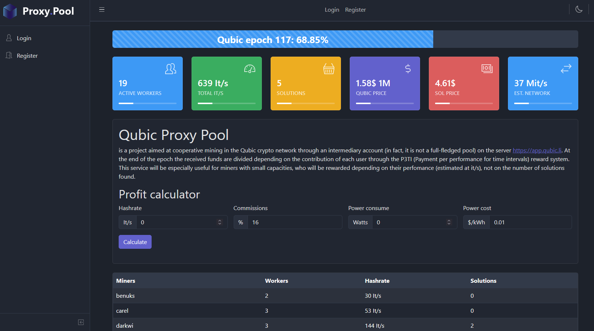
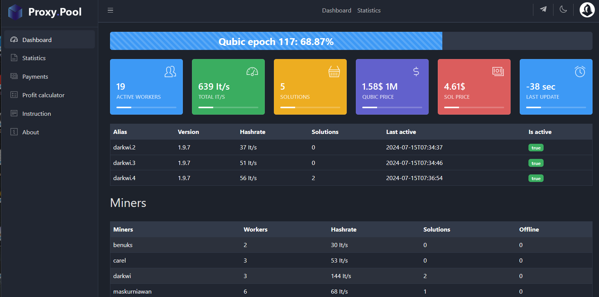
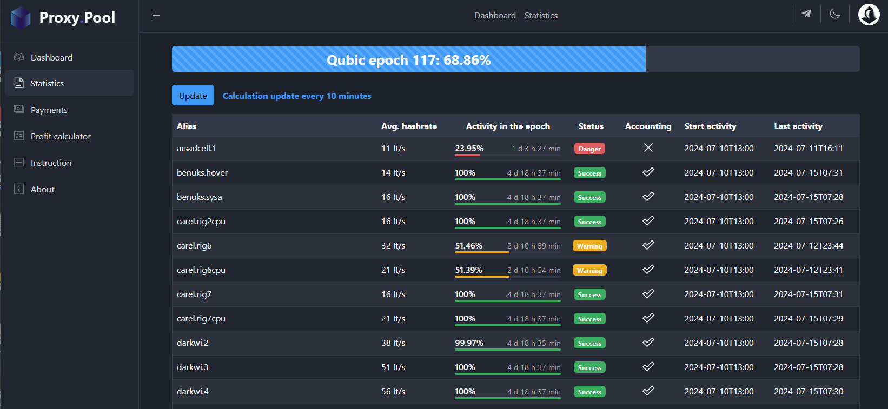
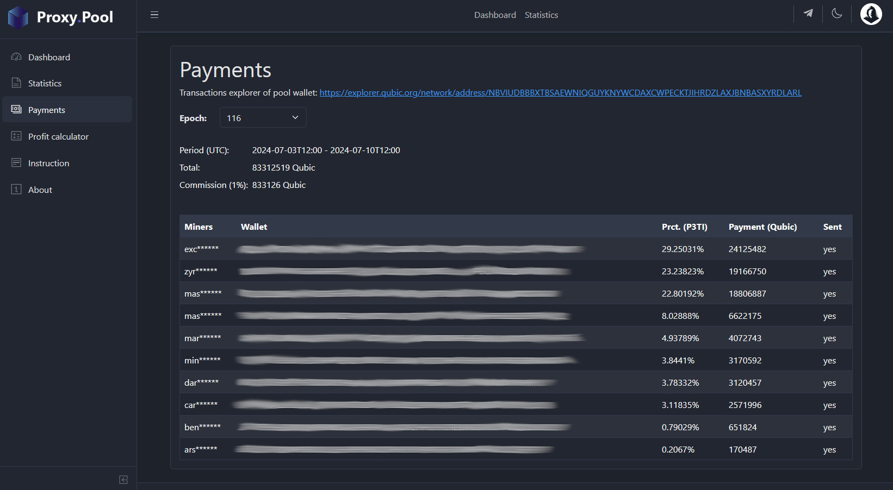

is a project aimed at cooperative mining in the Qubic crypto network through an intermediary account (in fact, it is not a full-fledged pool) on the server https://app.qubic.li

At the end of the epoch the received funds are divided depending on the contribution of each user through the P3TI (Payment per performance for time intervals) reward system. This service will be especially useful for miners with small capacities, who will be rewarded depending on their perfomance (estimated at it/s), not on the number of solutions found.

The pool uses the P3TI (Payment per performance for time intervals) system to calculate rewards. The pool calculates the reward for the average perfomance (estimated at it/s) in a certain time interval, regardless of whether the pool found a solution or not. Time intervals are evenly distributed across the epoch. That is, a miner who had a stable perfomance (estimated at it/s) throughout the epoch will receive a greater reward than those who joined during the epoch or had fluctuating perfomance.

## Pool rules

- **Only friends. Hashrate without taking into account the share during mining is not a reliable indicator and can only be taken into account by people you trust.**
- Active pool - qubic.li CPU/GPU Mining (Fixed Reward 85%)
- The commission of Qubic.li  - 15%
- Intermediary commission of QubicProxyPool - 1%
- The calculation of the share of miners is carried out for the era of Qubic from Wednesday 13:00 UTC until the next Wednesday 12:00 UTC, that is 7 days 
- The first hour of the new epoch is not taken into account due to the transition and connection of new miners
- The minimum total worker accounting time for an epoch is 2 days
- Payouts are made after the epoch has ended (Wednesday 12 UTC), need time to calculate. Without any abnormal activitiy and a stable network, QubicProxyPool will get Qubic coins until Friday (23:59 UTC).  Then payments will be made to users
- For Qubic cryptocurrency payments, be sure to specify your wallet (not exchange), registered on the official resource https://wallet.qubic.org. Otherwise, when transferring to an exchange wallet, there can be problems, and you will not receive your payment for a long time

## Screens

Using CoreUI UI Components https://coreui.io

## License

MIT